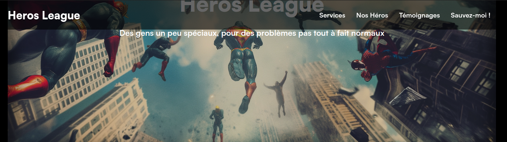
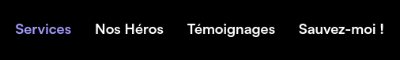
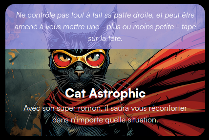
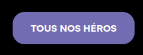
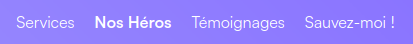
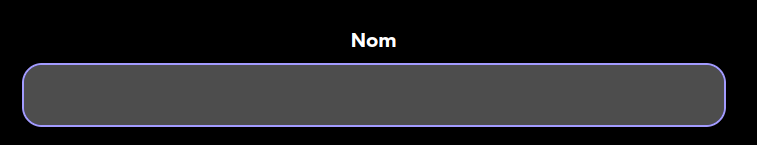
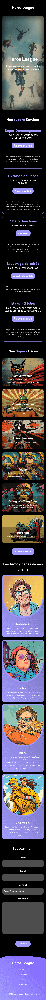

# Heros League a besoin de toi !

**Heros League&trade;** est une société de mise à disposition de **super-héros** pour des situations d'urgence en tout genre. Nous avons besoin de toi pour créer un site web qui permettra de présenter nos différents services et de pouvoir lancer un appel à l'aide.

Pour l'instant ce n'est qu'**une page d'accueil**, mais on te recontactera rapidement pour **ajouter de nouvelles fonctionnalités.**

**Prêt à servir la League ?** :muscle: :rocket:

Tu trouveras dans les **ressources** tout ce dont tu as besoin pour réaliser ce projet.

## Consignes

- La police d'écriture est celle-ci : [Satoshi](https://www.fontshare.com/?q=Satoshi)
  - Le designer nous a dit qu'il y avait pas mal de graisses différentes à prendre
- Pour les couleurs, on ne les a plus sous la main, mais on imagine que tu trouveras un moyen de les récupérer :wink:
- N'hésite pas à prendre la maquette de la home et la glisser / déposer dans ton navigateur pour la voir comme si c'était le site web (appuie sur la maquette dans le navigateur pour la zoomer à la largeur de l'écran)
- Les liens du menus doivent être des ancres qui pointent vers la section correspondante
- La première section avec la grande image doit prendre tout l'espace disponible dans la hauteur de l'écran (et ne pas dépasser !)
- Au survol d'un héros, un texte supplémentaire doit apparaître par dessus l'image (voir maquette). Petit détail, le texte doit apparaître par le haut de l'image
- Il y a un bouton pour voir plus de héros mais pour le moment il n'y a pas de page de prévue par le designer, donc renseigne "#" en lien, on verra plus tard !
- Sinon tu es libre de faire comme tu veux, tant que ça ressemble à la maquette ! :smile:

## Maquette globale

### Header

Le menu doit passer par dessus le contenu au scroll.

## Hovers

### Menu

### Héros

### Bouton

### Footer menu 

## Input Focus Outline

## Responsive

### Tablette

### Mobile

